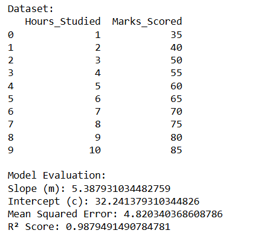
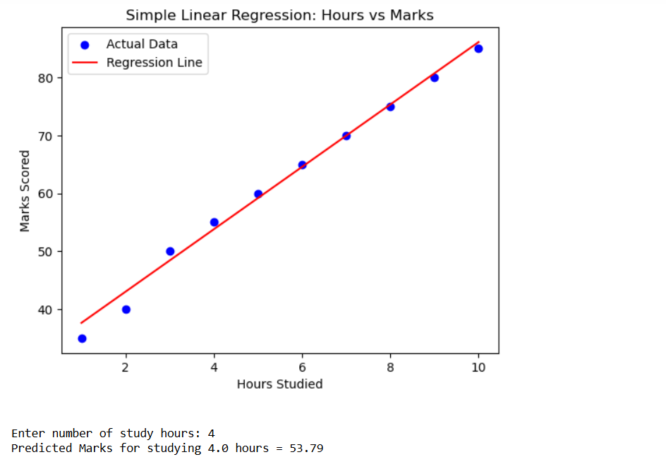

# Implementation-of-Simple-Linear-Regression-Model-for-Predicting-the-Marks-Scored

## AIM:
To write a program to predict the marks scored by a student using the simple linear regression model.

## Equipments Required:
1. Hardware – PCs
2. Anaconda – Python 3.7 Installation / Jupyter notebook

## Algorithm

1. Load the dataset into a DataFrame and explore its contents to understand the data structure.
2. Separate the dataset into independent (X) and dependent (Y) variables, and split them into training and testing sets.
3. Create a linear regression model and fit it using the training data.
4. Predict the results for the testing set and plot the training and testing sets with fitted lines.
5. Calculate error metrics (MSE, MAE, RMSE) to evaluate the model’s performance.

## Program:
```

import numpy as np
import pandas as pd
import matplotlib.pyplot as plt
from sklearn.linear_model import LinearRegression
from sklearn.model_selection import train_test_split
from sklearn.metrics import mean_squared_error, r2_score

data = {
    'Hours_Studied': [1, 2, 3, 4, 5, 6, 7, 8, 9, 10],
    'Marks_Scored':  [35, 40, 50, 55, 60, 65, 70, 75, 80, 85]
}

df = pd.DataFrame(data)
print("Dataset:")
print(df)

X = df[['Hours_Studied']]  
y = df['Marks_Scored']     

X_train, X_test, y_train, y_test = train_test_split(X, y, test_size=0.2, random_state=42)

model = LinearRegression()
model.fit(X_train, y_train)

y_pred = model.predict(X_test)

print("\nModel Evaluation:")
print("Slope (m):", model.coef_[0])
print("Intercept (c):", model.intercept_)
print("Mean Squared Error:", mean_squared_error(y_test, y_pred))
print("R² Score:", r2_score(y_test, y_pred))

plt.scatter(X, y, color='blue', label='Actual Data')
plt.plot(X, model.predict(X), color='red', label='Regression Line')
plt.xlabel('Hours Studied')
plt.ylabel('Marks Scored')
plt.title('Simple Linear Regression: Hours vs Marks')
plt.legend()
plt.show()

hours = float(input("\nEnter number of study hours: "))
predicted_marks = model.predict([[hours]])
print(f"Predicted Marks for studying {hours} hours = {predicted_marks[0]:.2f}")

```

## Output:





## Result:
Thus the program to implement the simple linear regression model for predicting the marks scored is written and verified using python programming.
